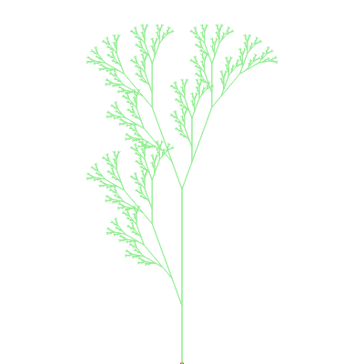

# Examples

## Koch Curve:
### Iteration 1

### Iteration 6

## Beautiful Tree

[Algorithmic Beauty of Plants](/turtle/eyJwYXRoIjoiRkZGRkZGRkZGRkZGRkZGRkZGRkZGRkZGRkZGRkZGRkZGRkZGRkZGRkZGRkZGRkZGRkZGRkZGRkZGRkZGRkZGRlsrRkZGRkZGRkZGRkZGRkZGRkZGRkZGRkZGRkZGRkZGRkZbK0ZGRkZGRkZGRkZGRkZGRkZbK0ZGRkZGRkZGWytGRkZGWytGRlsrRlsrWF1GRlstWF0rWF1GRkZGWy1GWytYXUZGWy1YXStYXStGWytYXUZGWy1YXStYXUZGRkZGRkZGWy1GRlsrRlsrWF1GRlstWF0rWF1GRkZGWy1GWytYXUZGWy1YXStYXStGWytYXUZGWy1YXStYXStGRlsrRlsrWF1GRlstWF0rWF1GRkZGWy1GWytYXUZGWy1YXStYXStGWytYXUZGWy1YXStYXUZGRkZGRkZGRkZGRkZGRkZbLUZGRkZbK0ZGWytGWytYXUZGWy1YXStYXUZGRkZbLUZbK1hdRkZbLVhdK1hdK0ZbK1hdRkZbLVhdK1hdRkZGRkZGRkZbLUZGWytGWytYXUZGWy1YXStYXUZGRkZbLUZbK1hdRkZbLVhdK1hdK0ZbK1hdRkZbLVhdK1hdK0ZGWytGWytYXUZGWy1YXStYXUZGRkZbLUZbK1hdRkZbLVhdK1hdK0ZbK1hdRkZbLVhdK1hdK0ZGRkZbK0ZGWytGWytYXUZGWy1YXStYXUZGRkZbLUZbK1hdRkZbLVhdK1hdK0ZbK1hdRkZbLVhdK1hdRkZGRkZGRkZbLUZGWytGWytYXUZGWy1YXStYXUZGRkZbLUZbK1hdRkZbLVhdK1hdK0ZbK1hdRkZbLVhdK1hdK0ZGWytGWytYXUZGWy1YXStYXUZGRkZbLUZbK1hdRkZbLVhdK1hdK0ZbK1hdRkZbLVhdK1hdRkZGRkZGRkZGRkZGRkZGRkZGRkZGRkZGRkZGRkZGRkZbLUZGRkZGRkZGWytGRkZGWytGRlsrRlsrWF1GRlstWF0rWF1GRkZGWy1GWytYXUZGWy1YXStYXStGWytYXUZGWy1YXStYXUZGRkZGRkZGWy1GRlsrRlsrWF1GRlstWF0rWF1GRkZGWy1GWytYXUZGWy1YXStYXStGWytYXUZGWy1YXStYXStGRlsrRlsrWF1GRlstWF0rWF1GRkZGWy1GWytYXUZGWy1YXStYXStGWytYXUZGWy1YXStYXUZGRkZGRkZGRkZGRkZGRkZbLUZGRkZbK0ZGWytGWytYXUZGWy1YXStYXUZGRkZbLUZbK1hdRkZbLVhdK1hdK0ZbK1hdRkZbLVhdK1hdRkZGRkZGRkZbLUZGWytGWytYXUZGWy1YXStYXUZGRkZbLUZbK1hdRkZbLVhdK1hdK0ZbK1hdRkZbLVhdK1hdK0ZGWytGWytYXUZGWy1YXStYXUZGRkZbLUZbK1hdRkZbLVhdK1hdK0ZbK1hdRkZbLVhdK1hdK0ZGRkZbK0ZGWytGWytYXUZGWy1YXStYXUZGRkZbLUZbK1hdRkZbLVhdK1hdK0ZbK1hdRkZbLVhdK1hdRkZGRkZGRkZbLUZGWytGWytYXUZGWy1YXStYXUZGRkZbLUZbK1hdRkZbLVhdK1hdK0ZbK1hdRkZbLVhdK1hdK0ZGWytGWytYXUZGWy1YXStYXUZGRkZbLUZbK1hdRkZbLVhdK1hdK0ZbK1hdRkZbLVhdK1hdK0ZGRkZGRkZGWytGRkZGWytGRlsrRlsrWF1GRlstWF0rWF1GRkZGWy1GWytYXUZGWy1YXStYXStGWytYXUZGWy1YXStYXUZGRkZGRkZGWy1GRlsrRlsrWF1GRlstWF0rWF1GRkZGWy1GWytYXUZGWy1YXStYXStGWytYXUZGWy1YXStYXStGRlsrRlsrWF1GRlstWF0rWF1GRkZGWy1GWytYXUZGWy1YXStYXStGWytYXUZGWy1YXStYXUZGRkZGRkZGRkZGRkZGRkZbLUZGRkZbK0ZGWytGWytYXUZGWy1YXStYXUZGRkZbLUZbK1hdRkZbLVhdK1hdK0ZbK1hdRkZbLVhdK1hdRkZGRkZGRkZbLUZGWytGWytYXUZGWy1YXStYXUZGRkZbLUZbK1hdRkZbLVhdK1hdK0ZbK1hdRkZbLVhdK1hdK0ZGWytGWytYXUZGWy1YXStYXUZGRkZbLUZbK1hdRkZbLVhdK1hdK0ZbK1hdRkZbLVhdK1hdK0ZGRkZbK0ZGWytGWytYXUZGWy1YXStYXUZGRkZbLUZbK1hdRkZbLVhdK1hdK0ZbK1hdRkZbLVhdK1hdRkZGRkZGRkZbLUZGWytGWytYXUZGWy1YXStYXUZGRkZbLUZbK1hdRkZbLVhdK1hdK0ZbK1hdRkZbLVhdK1hdK0ZGWytGWytYXUZGWy1YXStYXUZGRkZbLUZbK1hdRkZbLVhdK1hdK0ZbK1hdRkZbLVhdK1hdRkZGRkZGRkZGRkZGRkZGRkZGRkZGRkZGRkZGRkZGRkZGRkZGRkZGRkZGRkZGRkZGRkZGRkZGRkZGRkZGRkZGRlstRkZGRkZGRkZGRkZGRkZGRlsrRkZGRkZGRkZbK0ZGRkZbK0ZGWytGWytYXUZGWy1YXStYXUZGRkZbLUZbK1hdRkZbLVhdK1hdK0ZbK1hdRkZbLVhdK1hdRkZGRkZGRkZbLUZGWytGWytYXUZGWy1YXStYXUZGRkZbLUZbK1hdRkZbLVhdK1hdK0ZbK1hdRkZbLVhdK1hdK0ZGWytGWytYXUZGWy1YXStYXUZGRkZbLUZbK1hdRkZbLVhdK1hdK0ZbK1hdRkZbLVhdK1hdRkZGRkZGRkZGRkZGRkZGRlstRkZGRlsrRkZbK0ZbK1hdRkZbLVhdK1hdRkZGRlstRlsrWF1GRlstWF0rWF0rRlsrWF1GRlstWF0rWF1GRkZGRkZGRlstRkZbK0ZbK1hdRkZbLVhdK1hdRkZGRlstRlsrWF1GRlstWF0rWF0rRlsrWF1GRlstWF0rWF0rRkZbK0ZbK1hdRkZbLVhdK1hdRkZGRlstRlsrWF1GRlstWF0rWF0rRlsrWF1GRlstWF0rWF0rRkZGRlsrRkZbK0ZbK1hdRkZbLVhdK1hdRkZGRlstRlsrWF1GRlstWF0rWF0rRlsrWF1GRlstWF0rWF1GRkZGRkZGRlstRkZbK0ZbK1hdRkZbLVhdK1hdRkZGRlstRlsrWF1GRlstWF0rWF0rRlsrWF1GRlstWF0rWF0rRkZbK0ZbK1hdRkZbLVhdK1hdRkZGRlstRlsrWF1GRlstWF0rWF0rRlsrWF1GRlstWF0rWF1GRkZGRkZGRkZGRkZGRkZGRkZGRkZGRkZGRkZGRkZGRlstRkZGRkZGRkZbK0ZGRkZbK0ZGWytGWytYXUZGWy1YXStYXUZGRkZbLUZbK1hdRkZbLVhdK1hdK0ZbK1hdRkZbLVhdK1hdRkZGRkZGRkZbLUZGWytGWytYXUZGWy1YXStYXUZGRkZbLUZbK1hdRkZbLVhdK1hdK0ZbK1hdRkZbLVhdK1hdK0ZGWytGWytYXUZGWy1YXStYXUZGRkZbLUZbK1hdRkZbLVhdK1hdK0ZbK1hdRkZbLVhdK1hdRkZGRkZGRkZGRkZGRkZGRlstRkZGRlsrRkZbK0ZbK1hdRkZbLVhdK1hdRkZGRlstRlsrWF1GRlstWF0rWF0rRlsrWF1GRlstWF0rWF1GRkZGRkZGRlstRkZbK0ZbK1hdRkZbLVhdK1hdRkZGRlstRlsrWF1GRlstWF0rWF0rRlsrWF1GRlstWF0rWF0rRkZbK0ZbK1hdRkZbLVhdK1hdRkZGRlstRlsrWF1GRlstWF0rWF0rRlsrWF1GRlstWF0rWF0rRkZGRlsrRkZbK0ZbK1hdRkZbLVhdK1hdRkZGRlstRlsrWF1GRlstWF0rWF0rRlsrWF1GRlstWF0rWF1GRkZGRkZGRlstRkZbK0ZbK1hdRkZbLVhdK1hdRkZGRlstRlsrWF1GRlstWF0rWF0rRlsrWF1GRlstWF0rWF0rRkZbK0ZbK1hdRkZbLVhdK1hdRkZGRlstRlsrWF1GRlstWF0rWF0rRlsrWF1GRlstWF0rWF0rRkZGRkZGRkZbK0ZGRkZbK0ZGWytGWytYXUZGWy1YXStYXUZGRkZbLUZbK1hdRkZbLVhdK1hdK0ZbK1hdRkZbLVhdK1hdRkZGRkZGRkZbLUZGWytGWytYXUZGWy1YXStYXUZGRkZbLUZbK1hdRkZbLVhdK1hdK0ZbK1hdRkZbLVhdK1hdK0ZGWytGWytYXUZGWy1YXStYXUZGRkZbLUZbK1hdRkZbLVhdK1hdK0ZbK1hdRkZbLVhdK1hdRkZGRkZGRkZGRkZGRkZGRlstRkZGRlsrRkZbK0ZbK1hdRkZbLVhdK1hdRkZGRlstRlsrWF1GRlstWF0rWF0rRlsrWF1GRlstWF0rWF1GRkZGRkZGRlstRkZbK0ZbK1hdRkZbLVhdK1hdRkZGRlstRlsrWF1GRlstWF0rWF0rRlsrWF1GRlstWF0rWF0rRkZbK0ZbK1hdRkZbLVhdK1hdRkZGRlstRlsrWF1GRlstWF0rWF0rRlsrWF1GRlstWF0rWF0rRkZGRlsrRkZbK0ZbK1hdRkZbLVhdK1hdRkZGRlstRlsrWF1GRlstWF0rWF0rRlsrWF1GRlstWF0rWF1GRkZGRkZGRlstRkZbK0ZbK1hdRkZbLVhdK1hdRkZGRlstRlsrWF1GRlstWF0rWF0rRlsrWF1GRlstWF0rWF0rRkZbK0ZbK1hdRkZbLVhdK1hdRkZGRlstRlsrWF1GRlstWF0rWF0rRlsrWF1GRlstWF0rWF0rRkZGRkZGRkZGRkZGRkZGRlsrRkZGRkZGRkZbK0ZGRkZbK0ZGWytGWytYXUZGWy1YXStYXUZGRkZbLUZbK1hdRkZbLVhdK1hdK0ZbK1hdRkZbLVhdK1hdRkZGRkZGRkZbLUZGWytGWytYXUZGWy1YXStYXUZGRkZbLUZbK1hdRkZbLVhdK1hdK0ZbK1hdRkZbLVhdK1hdK0ZGWytGWytYXUZGWy1YXStYXUZGRkZbLUZbK1hdRkZbLVhdK1hdK0ZbK1hdRkZbLVhdK1hdRkZGRkZGRkZGRkZGRkZGRlstRkZGRlsrRkZbK0ZbK1hdRkZbLVhdK1hdRkZGRlstRlsrWF1GRlstWF0rWF0rRlsrWF1GRlstWF0rWF1GRkZGRkZGRlstRkZbK0ZbK1hdRkZbLVhdK1hdRkZGRlstRlsrWF1GRlstWF0rWF0rRlsrWF1GRlstWF0rWF0rRkZbK0ZbK1hdRkZbLVhdK1hdRkZGRlstRlsrWF1GRlstWF0rWF0rRlsrWF1GRlstWF0rWF0rRkZGRlsrRkZbK0ZbK1hdRkZbLVhdK1hdRkZGRlstRlsrWF1GRlstWF0rWF0rRlsrWF1GRlstWF0rWF1GRkZGRkZGRlstRkZbK0ZbK1hdRkZbLVhdK1hdRkZGRlstRlsrWF1GRlstWF0rWF0rRlsrWF1GRlstWF0rWF0rRkZbK0ZbK1hdRkZbLVhdK1hdRkZGRlstRlsrWF1GRlstWF0rWF0rRlsrWF1GRlstWF0rWF1GRkZGRkZGRkZGRkZGRkZGRkZGRkZGRkZGRkZGRkZGRlstRkZGRkZGRkZbK0ZGRkZbK0ZGWytGWytYXUZGWy1YXStYXUZGRkZbLUZbK1hdRkZbLVhdK1hdK0ZbK1hdRkZbLVhdK1hdRkZGRkZGRkZbLUZGWytGWytYXUZGWy1YXStYXUZGRkZbLUZbK1hdRkZbLVhdK1hdK0ZbK1hdRkZbLVhdK1hdK0ZGWytGWytYXUZGWy1YXStYXUZGRkZbLUZbK1hdRkZbLVhdK1hdK0ZbK1hdRkZbLVhdK1hdRkZGRkZGRkZGRkZGRkZGRlstRkZGRlsrRkZbK0ZbK1hdRkZbLVhdK1hdRkZGRlstRlsrWF1GRlstWF0rWF0rRlsrWF1GRlstWF0rWF1GRkZGRkZGRlstRkZbK0ZbK1hdRkZbLVhdK1hdRkZGRlstRlsrWF1GRlstWF0rWF0rRlsrWF1GRlstWF0rWF0rRkZbK0ZbK1hdRkZbLVhdK1hdRkZGRlstRlsrWF1GRlstWF0rWF0rRlsrWF1GRlstWF0rWF0rRkZGRlsrRkZbK0ZbK1hdRkZbLVhdK1hdRkZGRlstRlsrWF1GRlstWF0rWF0rRlsrWF1GRlstWF0rWF1GRkZGRkZGRlstRkZbK0ZbK1hdRkZbLVhdK1hdRkZGRlstRlsrWF1GRlstWF0rWF0rRlsrWF1GRlstWF0rWF0rRkZbK0ZbK1hdRkZbLVhdK1hdRkZGRlstRlsrWF1GRlstWF0rWF0rRlsrWF1GRlstWF0rWF0rRkZGRkZGRkZbK0ZGRkZbK0ZGWytGWytYXUZGWy1YXStYXUZGRkZbLUZbK1hdRkZbLVhdK1hdK0ZbK1hdRkZbLVhdK1hdRkZGRkZGRkZbLUZGWytGWytYXUZGWy1YXStYXUZGRkZbLUZbK1hdRkZbLVhdK1hdK0ZbK1hdRkZbLVhdK1hdK0ZGWytGWytYXUZGWy1YXStYXUZGRkZbLUZbK1hdRkZbLVhdK1hdK0ZbK1hdRkZbLVhdK1hdRkZGRkZGRkZGRkZGRkZGRlstRkZGRlsrRkZbK0ZbK1hdRkZbLVhdK1hdRkZGRlstRlsrWF1GRlstWF0rWF0rRlsrWF1GRlstWF0rWF1GRkZGRkZGRlstRkZbK0ZbK1hdRkZbLVhdK1hdRkZGRlstRlsrWF1GRlstWF0rWF0rRlsrWF1GRlstWF0rWF0rRkZbK0ZbK1hdRkZbLVhdK1hdRkZGRlstRlsrWF1GRlstWF0rWF0rRlsrWF1GRlstWF0rWF0rRkZGRlsrRkZbK0ZbK1hdRkZbLVhdK1hdRkZGRlstRlsrWF1GRlstWF0rWF0rRlsrWF1GRlstWF0rWF1GRkZGRkZGRlstRkZbK0ZbK1hdRkZbLVhdK1hdRkZGRlstRlsrWF1GRlstWF0rWF0rRlsrWF1GRlstWF0rWF0rRkZbK0ZbK1hdRkZbLVhdK1hdRkZGRlstRlsrWF1GRlstWF0rWF0rRlsrWF1GRlstWF0rWF1GRkZGRkZGRkZGRkZGRkZGRkZGRkZGRkZGRkZGRkZGRkZGRkZGRkZGRkZGRkZGRkZGRkZGRkZGRkZGRkZGRkZGRkZGRkZGRkZGRkZGRkZGRkZGRkZGRkZGRkZGRkZGRkZGRkZGRkZGRkZGRkZGRkZGRkZGRkZGRkZGRkZGRkZGRlstRkZGRkZGRkZGRkZGRkZGRkZGRkZGRkZGRkZGRkZGRkZbK0ZGRkZGRkZGRkZGRkZGRkZbK0ZGRkZGRkZGWytGRkZGWytGRlsrRlsrWF1GRlstWF0rWF1GRkZGWy1GWytYXUZGWy1YXStYXStGWytYXUZGWy1YXStYXUZGRkZGRkZGWy1GRlsrRlsrWF1GRlstWF0rWF1GRkZGWy1GWytYXUZGWy1YXStYXStGWytYXUZGWy1YXStYXStGRlsrRlsrWF1GRlstWF0rWF1GRkZGWy1GWytYXUZGWy1YXStYXStGWytYXUZGWy1YXStYXUZGRkZGRkZGRkZGRkZGRkZbLUZGRkZbK0ZGWytGWytYXUZGWy1YXStYXUZGRkZbLUZbK1hdRkZbLVhdK1hdK0ZbK1hdRkZbLVhdK1hdRkZGRkZGRkZbLUZGWytGWytYXUZGWy1YXStYXUZGRkZbLUZbK1hdRkZbLVhdK1hdK0ZbK1hdRkZbLVhdK1hdK0ZGWytGWytYXUZGWy1YXStYXUZGRkZbLUZbK1hdRkZbLVhdK1hdK0ZbK1hdRkZbLVhdK1hdK0ZGRkZbK0ZGWytGWytYXUZGWy1YXStYXUZGRkZbLUZbK1hdRkZbLVhdK1hdK0ZbK1hdRkZbLVhdK1hdRkZGRkZGRkZbLUZGWytGWytYXUZGWy1YXStYXUZGRkZbLUZbK1hdRkZbLVhdK1hdK0ZbK1hdRkZbLVhdK1hdK0ZGWytGWytYXUZGWy1YXStYXUZGRkZbLUZbK1hdRkZbLVhdK1hdK0ZbK1hdRkZbLVhdK1hdRkZGRkZGRkZGRkZGRkZGRkZGRkZGRkZGRkZGRkZGRkZbLUZGRkZGRkZGWytGRkZGWytGRlsrRlsrWF1GRlstWF0rWF1GRkZGWy1GWytYXUZGWy1YXStYXStGWytYXUZGWy1YXStYXUZGRkZGRkZGWy1GRlsrRlsrWF1GRlstWF0rWF1GRkZGWy1GWytYXUZGWy1YXStYXStGWytYXUZGWy1YXStYXStGRlsrRlsrWF1GRlstWF0rWF1GRkZGWy1GWytYXUZGWy1YXStYXStGWytYXUZGWy1YXStYXUZGRkZGRkZGRkZGRkZGRkZbLUZGRkZbK0ZGWytGWytYXUZGWy1YXStYXUZGRkZbLUZbK1hdRkZbLVhdK1hdK0ZbK1hdRkZbLVhdK1hdRkZGRkZGRkZbLUZGWytGWytYXUZGWy1YXStYXUZGRkZbLUZbK1hdRkZbLVhdK1hdK0ZbK1hdRkZbLVhdK1hdK0ZGWytGWytYXUZGWy1YXStYXUZGRkZbLUZbK1hdRkZbLVhdK1hdK0ZbK1hdRkZbLVhdK1hdK0ZGRkZbK0ZGWytGWytYXUZGWy1YXStYXUZGRkZbLUZbK1hdRkZbLVhdK1hdK0ZbK1hdRkZbLVhdK1hdRkZGRkZGRkZbLUZGWytGWytYXUZGWy1YXStYXUZGRkZbLUZbK1hdRkZbLVhdK1hdK0ZbK1hdRkZbLVhdK1hdK0ZGWytGWytYXUZGWy1YXStYXUZGRkZbLUZbK1hdRkZbLVhdK1hdK0ZbK1hdRkZbLVhdK1hdK0ZGRkZGRkZGWytGRkZGWytGRlsrRlsrWF1GRlstWF0rWF1GRkZGWy1GWytYXUZGWy1YXStYXStGWytYXUZGWy1YXStYXUZGRkZGRkZGWy1GRlsrRlsrWF1GRlstWF0rWF1GRkZGWy1GWytYXUZGWy1YXStYXStGWytYXUZGWy1YXStYXStGRlsrRlsrWF1GRlstWF0rWF1GRkZGWy1GWytYXUZGWy1YXStYXStGWytYXUZGWy1YXStYXUZGRkZGRkZGRkZGRkZGRkZbLUZGRkZbK0ZGWytGWytYXUZGWy1YXStYXUZGRkZbLUZbK1hdRkZbLVhdK1hdK0ZbK1hdRkZbLVhdK1hdRkZGRkZGRkZbLUZGWytGWytYXUZGWy1YXStYXUZGRkZbLUZbK1hdRkZbLVhdK1hdK0ZbK1hdRkZbLVhdK1hdK0ZGWytGWytYXUZGWy1YXStYXUZGRkZbLUZbK1hdRkZbLVhdK1hdK0ZbK1hdRkZbLVhdK1hdK0ZGRkZbK0ZGWytGWytYXUZGWy1YXStYXUZGRkZbLUZbK1hdRkZbLVhdK1hdK0ZbK1hdRkZbLVhdK1hdRkZGRkZGRkZbLUZGWytGWytYXUZGWy1YXStYXUZGRkZbLUZbK1hdRkZbLVhdK1hdK0ZbK1hdRkZbLVhdK1hdK0ZGWytGWytYXUZGWy1YXStYXUZGRkZbLUZbK1hdRkZbLVhdK1hdK0ZbK1hdRkZbLVhdK1hdRkZGRkZGRkZGRkZGRkZGRkZGRkZGRkZGRkZGRkZGRkZGRkZGRkZGRkZGRkZGRkZGRkZGRkZGRkZGRkZGRkZGRlstRkZGRkZGRkZGRkZGRkZGRlsrRkZGRkZGRkZbK0ZGRkZbK0ZGWytGWytYXUZGWy1YXStYXUZGRkZbLUZbK1hdRkZbLVhdK1hdK0ZbK1hdRkZbLVhdK1hdRkZGRkZGRkZbLUZGWytGWytYXUZGWy1YXStYXUZGRkZbLUZbK1hdRkZbLVhdK1hdK0ZbK1hdRkZbLVhdK1hdK0ZGWytGWytYXUZGWy1YXStYXUZGRkZbLUZbK1hdRkZbLVhdK1hdK0ZbK1hdRkZbLVhdK1hdRkZGRkZGRkZGRkZGRkZGRlstRkZGRlsrRkZbK0ZbK1hdRkZbLVhdK1hdRkZGRlstRlsrWF1GRlstWF0rWF0rRlsrWF1GRlstWF0rWF1GRkZGRkZGRlstRkZbK0ZbK1hdRkZbLVhdK1hdRkZGRlstRlsrWF1GRlstWF0rWF0rRlsrWF1GRlstWF0rWF0rRkZbK0ZbK1hdRkZbLVhdK1hdRkZGRlstRlsrWF1GRlstWF0rWF0rRlsrWF1GRlstWF0rWF0rRkZGRlsrRkZbK0ZbK1hdRkZbLVhdK1hdRkZGRlstRlsrWF1GRlstWF0rWF0rRlsrWF1GRlstWF0rWF1GRkZGRkZGRlstRkZbK0ZbK1hdRkZbLVhdK1hdRkZGRlstRlsrWF1GRlstWF0rWF0rRlsrWF1GRlstWF0rWF0rRkZbK0ZbK1hdRkZbLVhdK1hdRkZGRlstRlsrWF1GRlstWF0rWF0rRlsrWF1GRlstWF0rWF1GRkZGRkZGRkZGRkZGRkZGRkZGRkZGRkZGRkZGRkZGRlstRkZGRkZGRkZbK0ZGRkZbK0ZGWytGWytYXUZGWy1YXStYXUZGRkZbLUZbK1hdRkZbLVhdK1hdK0ZbK1hdRkZbLVhdK1hdRkZGRkZGRkZbLUZGWytGWytYXUZGWy1YXStYXUZGRkZbLUZbK1hdRkZbLVhdK1hdK0ZbK1hdRkZbLVhdK1hdK0ZGWytGWytYXUZGWy1YXStYXUZGRkZbLUZbK1hdRkZbLVhdK1hdK0ZbK1hdRkZbLVhdK1hdRkZGRkZGRkZGRkZGRkZGRlstRkZGRlsrRkZbK0ZbK1hdRkZbLVhdK1hdRkZGRlstRlsrWF1GRlstWF0rWF0rRlsrWF1GRlstWF0rWF1GRkZGRkZGRlstRkZbK0ZbK1hdRkZbLVhdK1hdRkZGRlstRlsrWF1GRlstWF0rWF0rRlsrWF1GRlstWF0rWF0rRkZbK0ZbK1hdRkZbLVhdK1hdRkZGRlstRlsrWF1GRlstWF0rWF0rRlsrWF1GRlstWF0rWF0rRkZGRlsrRkZbK0ZbK1hdRkZbLVhdK1hdRkZGRlstRlsrWF1GRlstWF0rWF0rRlsrWF1GRlstWF0rWF1GRkZGRkZGRlstRkZbK0ZbK1hdRkZbLVhdK1hdRkZGRlstRlsrWF1GRlstWF0rWF0rRlsrWF1GRlstWF0rWF0rRkZbK0ZbK1hdRkZbLVhdK1hdRkZGRlstRlsrWF1GRlstWF0rWF0rRlsrWF1GRlstWF0rWF0rRkZGRkZGRkZbK0ZGRkZbK0ZGWytGWytYXUZGWy1YXStYXUZGRkZbLUZbK1hdRkZbLVhdK1hdK0ZbK1hdRkZbLVhdK1hdRkZGRkZGRkZbLUZGWytGWytYXUZGWy1YXStYXUZGRkZbLUZbK1hdRkZbLVhdK1hdK0ZbK1hdRkZbLVhdK1hdK0ZGWytGWytYXUZGWy1YXStYXUZGRkZbLUZbK1hdRkZbLVhdK1hdK0ZbK1hdRkZbLVhdK1hdRkZGRkZGRkZGRkZGRkZGRlstRkZGRlsrRkZbK0ZbK1hdRkZbLVhdK1hdRkZGRlstRlsrWF1GRlstWF0rWF0rRlsrWF1GRlstWF0rWF1GRkZGRkZGRlstRkZbK0ZbK1hdRkZbLVhdK1hdRkZGRlstRlsrWF1GRlstWF0rWF0rRlsrWF1GRlstWF0rWF0rRkZbK0ZbK1hdRkZbLVhdK1hdRkZGRlstRlsrWF1GRlstWF0rWF0rRlsrWF1GRlstWF0rWF0rRkZGRlsrRkZbK0ZbK1hdRkZbLVhdK1hdRkZGRlstRlsrWF1GRlstWF0rWF0rRlsrWF1GRlstWF0rWF1GRkZGRkZGRlstRkZbK0ZbK1hdRkZbLVhdK1hdRkZGRlstRlsrWF1GRlstWF0rWF0rRlsrWF1GRlstWF0rWF0rRkZbK0ZbK1hdRkZbLVhdK1hdRkZGRlstRlsrWF1GRlstWF0rWF0rRlsrWF1GRlstWF0rWF0rRkZGRkZGRkZGRkZGRkZGRlsrRkZGRkZGRkZbK0ZGRkZbK0ZGWytGWytYXUZGWy1YXStYXUZGRkZbLUZbK1hdRkZbLVhdK1hdK0ZbK1hdRkZbLVhdK1hdRkZGRkZGRkZbLUZGWytGWytYXUZGWy1YXStYXUZGRkZbLUZbK1hdRkZbLVhdK1hdK0ZbK1hdRkZbLVhdK1hdK0ZGWytGWytYXUZGWy1YXStYXUZGRkZbLUZbK1hdRkZbLVhdK1hdK0ZbK1hdRkZbLVhdK1hdRkZGRkZGRkZGRkZGRkZGRlstRkZGRlsrRkZbK0ZbK1hdRkZbLVhdK1hdRkZGRlstRlsrWF1GRlstWF0rWF0rRlsrWF1GRlstWF0rWF1GRkZGRkZGRlstRkZbK0ZbK1hdRkZbLVhdK1hdRkZGRlstRlsrWF1GRlstWF0rWF0rRlsrWF1GRlstWF0rWF0rRkZbK0ZbK1hdRkZbLVhdK1hdRkZGRlstRlsrWF1GRlstWF0rWF0rRlsrWF1GRlstWF0rWF0rRkZGRlsrRkZbK0ZbK1hdRkZbLVhdK1hdRkZGRlstRlsrWF1GRlstWF0rWF0rRlsrWF1GRlstWF0rWF1GRkZGRkZGRlstRkZbK0ZbK1hdRkZbLVhdK1hdRkZGRlstRlsrWF1GRlstWF0rWF0rRlsrWF1GRlstWF0rWF0rRkZbK0ZbK1hdRkZbLVhdK1hdRkZGRlstRlsrWF1GRlstWF0rWF0rRlsrWF1GRlstWF0rWF1GRkZGRkZGRkZGRkZGRkZGRkZGRkZGRkZGRkZGRkZGRlstRkZGRkZGRkZbK0ZGRkZbK0ZGWytGWytYXUZGWy1YXStYXUZGRkZbLUZbK1hdRkZbLVhdK1hdK0ZbK1hdRkZbLVhdK1hdRkZGRkZGRkZbLUZGWytGWytYXUZGWy1YXStYXUZGRkZbLUZbK1hdRkZbLVhdK1hdK0ZbK1hdRkZbLVhdK1hdK0ZGWytGWytYXUZGWy1YXStYXUZGRkZbLUZbK1hdRkZbLVhdK1hdK0ZbK1hdRkZbLVhdK1hdRkZGRkZGRkZGRkZGRkZGRlstRkZGRlsrRkZbK0ZbK1hdRkZbLVhdK1hdRkZGRlstRlsrWF1GRlstWF0rWF0rRlsrWF1GRlstWF0rWF1GRkZGRkZGRlstRkZbK0ZbK1hdRkZbLVhdK1hdRkZGRlstRlsrWF1GRlstWF0rWF0rRlsrWF1GRlstWF0rWF0rRkZbK0ZbK1hdRkZbLVhdK1hdRkZGRlstRlsrWF1GRlstWF0rWF0rRlsrWF1GRlstWF0rWF0rRkZGRlsrRkZbK0ZbK1hdRkZbLVhdK1hdRkZGRlstRlsrWF1GRlstWF0rWF0rRlsrWF1GRlstWF0rWF1GRkZGRkZGRlstRkZbK0ZbK1hdRkZbLVhdK1hdRkZGRlstRlsrWF1GRlstWF0rWF0rRlsrWF1GRlstWF0rWF0rRkZbK0ZbK1hdRkZbLVhdK1hdRkZGRlstRlsrWF1GRlstWF0rWF0rRlsrWF1GRlstWF0rWF0rRkZGRkZGRkZbK0ZGRkZbK0ZGWytGWytYXUZGWy1YXStYXUZGRkZbLUZbK1hdRkZbLVhdK1hdK0ZbK1hdRkZbLVhdK1hdRkZGRkZGRkZbLUZGWytGWytYXUZGWy1YXStYXUZGRkZbLUZbK1hdRkZbLVhdK1hdK0ZbK1hdRkZbLVhdK1hdK0ZGWytGWytYXUZGWy1YXStYXUZGRkZbLUZbK1hdRkZbLVhdK1hdK0ZbK1hdRkZbLVhdK1hdRkZGRkZGRkZGRkZGRkZGRlstRkZGRlsrRkZbK0ZbK1hdRkZbLVhdK1hdRkZGRlstRlsrWF1GRlstWF0rWF0rRlsrWF1GRlstWF0rWF1GRkZGRkZGRlstRkZbK0ZbK1hdRkZbLVhdK1hdRkZGRlstRlsrWF1GRlstWF0rWF0rRlsrWF1GRlstWF0rWF0rRkZbK0ZbK1hdRkZbLVhdK1hdRkZGRlstRlsrWF1GRlstWF0rWF0rRlsrWF1GRlstWF0rWF0rRkZGRlsrRkZbK0ZbK1hdRkZbLVhdK1hdRkZGRlstRlsrWF1GRlstWF0rWF0rRlsrWF1GRlstWF0rWF1GRkZGRkZGRlstRkZbK0ZbK1hdRkZbLVhdK1hdRkZGRlstRlsrWF1GRlstWF0rWF0rRlsrWF1GRlstWF0rWF0rRkZbK0ZbK1hdRkZbLVhdK1hdRkZGRlstRlsrWF1GRlstWF0rWF0rRlsrWF1GRlstWF0rWF0rRkZGRkZGRkZGRkZGRkZGRkZGRkZGRkZGRkZGRkZGRkZbK0ZGRkZGRkZGRkZGRkZGRkZbK0ZGRkZGRkZGWytGRkZGWytGRlsrRlsrWF1GRlstWF0rWF1GRkZGWy1GWytYXUZGWy1YXStYXStGWytYXUZGWy1YXStYXUZGRkZGRkZGWy1GRlsrRlsrWF1GRlstWF0rWF1GRkZGWy1GWytYXUZGWy1YXStYXStGWytYXUZGWy1YXStYXStGRlsrRlsrWF1GRlstWF0rWF1GRkZGWy1GWytYXUZGWy1YXStYXStGWytYXUZGWy1YXStYXUZGRkZGRkZGRkZGRkZGRkZbLUZGRkZbK0ZGWytGWytYXUZGWy1YXStYXUZGRkZbLUZbK1hdRkZbLVhdK1hdK0ZbK1hdRkZbLVhdK1hdRkZGRkZGRkZbLUZGWytGWytYXUZGWy1YXStYXUZGRkZbLUZbK1hdRkZbLVhdK1hdK0ZbK1hdRkZbLVhdK1hdK0ZGWytGWytYXUZGWy1YXStYXUZGRkZbLUZbK1hdRkZbLVhdK1hdK0ZbK1hdRkZbLVhdK1hdK0ZGRkZbK0ZGWytGWytYXUZGWy1YXStYXUZGRkZbLUZbK1hdRkZbLVhdK1hdK0ZbK1hdRkZbLVhdK1hdRkZGRkZGRkZbLUZGWytGWytYXUZGWy1YXStYXUZGRkZbLUZbK1hdRkZbLVhdK1hdK0ZbK1hdRkZbLVhdK1hdK0ZGWytGWytYXUZGWy1YXStYXUZGRkZbLUZbK1hdRkZbLVhdK1hdK0ZbK1hdRkZbLVhdK1hdRkZGRkZGRkZGRkZGRkZGRkZGRkZGRkZGRkZGRkZGRkZbLUZGRkZGRkZGWytGRkZGWytGRlsrRlsrWF1GRlstWF0rWF1GRkZGWy1GWytYXUZGWy1YXStYXStGWytYXUZGWy1YXStYXUZGRkZGRkZGWy1GRlsrRlsrWF1GRlstWF0rWF1GRkZGWy1GWytYXUZGWy1YXStYXStGWytYXUZGWy1YXStYXStGRlsrRlsrWF1GRlstWF0rWF1GRkZGWy1GWytYXUZGWy1YXStYXStGWytYXUZGWy1YXStYXUZGRkZGRkZGRkZGRkZGRkZbLUZGRkZbK0ZGWytGWytYXUZGWy1YXStYXUZGRkZbLUZbK1hdRkZbLVhdK1hdK0ZbK1hdRkZbLVhdK1hdRkZGRkZGRkZbLUZGWytGWytYXUZGWy1YXStYXUZGRkZbLUZbK1hdRkZbLVhdK1hdK0ZbK1hdRkZbLVhdK1hdK0ZGWytGWytYXUZGWy1YXStYXUZGRkZbLUZbK1hdRkZbLVhdK1hdK0ZbK1hdRkZbLVhdK1hdK0ZGRkZbK0ZGWytGWytYXUZGWy1YXStYXUZGRkZbLUZbK1hdRkZbLVhdK1hdK0ZbK1hdRkZbLVhdK1hdRkZGRkZGRkZbLUZGWytGWytYXUZGWy1YXStYXUZGRkZbLUZbK1hdRkZbLVhdK1hdK0ZbK1hdRkZbLVhdK1hdK0ZGWytGWytYXUZGWy1YXStYXUZGRkZbLUZbK1hdRkZbLVhdK1hdK0ZbK1hdRkZbLVhdK1hdK0ZGRkZGRkZGWytGRkZGWytGRlsrRlsrWF1GRlstWF0rWF1GRkZGWy1GWytYXUZGWy1YXStYXStGWytYXUZGWy1YXStYXUZGRkZGRkZGWy1GRlsrRlsrWF1GRlstWF0rWF1GRkZGWy1GWytYXUZGWy1YXStYXStGWytYXUZGWy1YXStYXStGRlsrRlsrWF1GRlstWF0rWF1GRkZGWy1GWytYXUZGWy1YXStYXStGWytYXUZGWy1YXStYXUZGRkZGRkZGRkZGRkZGRkZbLUZGRkZbK0ZGWytGWytYXUZGWy1YXStYXUZGRkZbLUZbK1hdRkZbLVhdK1hdK0ZbK1hdRkZbLVhdK1hdRkZGRkZGRkZbLUZGWytGWytYXUZGWy1YXStYXUZGRkZbLUZbK1hdRkZbLVhdK1hdK0ZbK1hdRkZbLVhdK1hdK0ZGWytGWytYXUZGWy1YXStYXUZGRkZbLUZbK1hdRkZbLVhdK1hdK0ZbK1hdRkZbLVhdK1hdK0ZGRkZbK0ZGWytGWytYXUZGWy1YXStYXUZGRkZbLUZbK1hdRkZbLVhdK1hdK0ZbK1hdRkZbLVhdK1hdRkZGRkZGRkZbLUZGWytGWytYXUZGWy1YXStYXUZGRkZbLUZbK1hdRkZbLVhdK1hdK0ZbK1hdRkZbLVhdK1hdK0ZGWytGWytYXUZGWy1YXStYXUZGRkZbLUZbK1hdRkZbLVhdK1hdK0ZbK1hdRkZbLVhdK1hdRkZGRkZGRkZGRkZGRkZGRkZGRkZGRkZGRkZGRkZGRkZGRkZGRkZGRkZGRkZGRkZGRkZGRkZGRkZGRkZGRkZGRlstRkZGRkZGRkZGRkZGRkZGRlsrRkZGRkZGRkZbK0ZGRkZbK0ZGWytGWytYXUZGWy1YXStYXUZGRkZbLUZbK1hdRkZbLVhdK1hdK0ZbK1hdRkZbLVhdK1hdRkZGRkZGRkZbLUZGWytGWytYXUZGWy1YXStYXUZGRkZbLUZbK1hdRkZbLVhdK1hdK0ZbK1hdRkZbLVhdK1hdK0ZGWytGWytYXUZGWy1YXStYXUZGRkZbLUZbK1hdRkZbLVhdK1hdK0ZbK1hdRkZbLVhdK1hdRkZGRkZGRkZGRkZGRkZGRlstRkZGRlsrRkZbK0ZbK1hdRkZbLVhdK1hdRkZGRlstRlsrWF1GRlstWF0rWF0rRlsrWF1GRlstWF0rWF1GRkZGRkZGRlstRkZbK0ZbK1hdRkZbLVhdK1hdRkZGRlstRlsrWF1GRlstWF0rWF0rRlsrWF1GRlstWF0rWF0rRkZbK0ZbK1hdRkZbLVhdK1hdRkZGRlstRlsrWF1GRlstWF0rWF0rRlsrWF1GRlstWF0rWF0rRkZGRlsrRkZbK0ZbK1hdRkZbLVhdK1hdRkZGRlstRlsrWF1GRlstWF0rWF0rRlsrWF1GRlstWF0rWF1GRkZGRkZGRlstRkZbK0ZbK1hdRkZbLVhdK1hdRkZGRlstRlsrWF1GRlstWF0rWF0rRlsrWF1GRlstWF0rWF0rRkZbK0ZbK1hdRkZbLVhdK1hdRkZGRlstRlsrWF1GRlstWF0rWF0rRlsrWF1GRlstWF0rWF1GRkZGRkZGRkZGRkZGRkZGRkZGRkZGRkZGRkZGRkZGRlstRkZGRkZGRkZbK0ZGRkZbK0ZGWytGWytYXUZGWy1YXStYXUZGRkZbLUZbK1hdRkZbLVhdK1hdK0ZbK1hdRkZbLVhdK1hdRkZGRkZGRkZbLUZGWytGWytYXUZGWy1YXStYXUZGRkZbLUZbK1hdRkZbLVhdK1hdK0ZbK1hdRkZbLVhdK1hdK0ZGWytGWytYXUZGWy1YXStYXUZGRkZbLUZbK1hdRkZbLVhdK1hdK0ZbK1hdRkZbLVhdK1hdRkZGRkZGRkZGRkZGRkZGRlstRkZGRlsrRkZbK0ZbK1hdRkZbLVhdK1hdRkZGRlstRlsrWF1GRlstWF0rWF0rRlsrWF1GRlstWF0rWF1GRkZGRkZGRlstRkZbK0ZbK1hdRkZbLVhdK1hdRkZGRlstRlsrWF1GRlstWF0rWF0rRlsrWF1GRlstWF0rWF0rRkZbK0ZbK1hdRkZbLVhdK1hdRkZGRlstRlsrWF1GRlstWF0rWF0rRlsrWF1GRlstWF0rWF0rRkZGRlsrRkZbK0ZbK1hdRkZbLVhdK1hdRkZGRlstRlsrWF1GRlstWF0rWF0rRlsrWF1GRlstWF0rWF1GRkZGRkZGRlstRkZbK0ZbK1hdRkZbLVhdK1hdRkZGRlstRlsrWF1GRlstWF0rWF0rRlsrWF1GRlstWF0rWF0rRkZbK0ZbK1hdRkZbLVhdK1hdRkZGRlstRlsrWF1GRlstWF0rWF0rRlsrWF1GRlstWF0rWF0rRkZGRkZGRkZbK0ZGRkZbK0ZGWytGWytYXUZGWy1YXStYXUZGRkZbLUZbK1hdRkZbLVhdK1hdK0ZbK1hdRkZbLVhdK1hdRkZGRkZGRkZbLUZGWytGWytYXUZGWy1YXStYXUZGRkZbLUZbK1hdRkZbLVhdK1hdK0ZbK1hdRkZbLVhdK1hdK0ZGWytGWytYXUZGWy1YXStYXUZGRkZbLUZbK1hdRkZbLVhdK1hdK0ZbK1hdRkZbLVhdK1hdRkZGRkZGRkZGRkZGRkZGRlstRkZGRlsrRkZbK0ZbK1hdRkZbLVhdK1hdRkZGRlstRlsrWF1GRlstWF0rWF0rRlsrWF1GRlstWF0rWF1GRkZGRkZGRlstRkZbK0ZbK1hdRkZbLVhdK1hdRkZGRlstRlsrWF1GRlstWF0rWF0rRlsrWF1GRlstWF0rWF0rRkZbK0ZbK1hdRkZbLVhdK1hdRkZGRlstRlsrWF1GRlstWF0rWF0rRlsrWF1GRlstWF0rWF0rRkZGRlsrRkZbK0ZbK1hdRkZbLVhdK1hdRkZGRlstRlsrWF1GRlstWF0rWF0rRlsrWF1GRlstWF0rWF1GRkZGRkZGRlstRkZbK0ZbK1hdRkZbLVhdK1hdRkZGRlstRlsrWF1GRlstWF0rWF0rRlsrWF1GRlstWF0rWF0rRkZbK0ZbK1hdRkZbLVhdK1hdRkZGRlstRlsrWF1GRlstWF0rWF0rRlsrWF1GRlstWF0rWF0rRkZGRkZGRkZGRkZGRkZGRlsrRkZGRkZGRkZbK0ZGRkZbK0ZGWytGWytYXUZGWy1YXStYXUZGRkZbLUZbK1hdRkZbLVhdK1hdK0ZbK1hdRkZbLVhdK1hdRkZGRkZGRkZbLUZGWytGWytYXUZGWy1YXStYXUZGRkZbLUZbK1hdRkZbLVhdK1hdK0ZbK1hdRkZbLVhdK1hdK0ZGWytGWytYXUZGWy1YXStYXUZGRkZbLUZbK1hdRkZbLVhdK1hdK0ZbK1hdRkZbLVhdK1hdRkZGRkZGRkZGRkZGRkZGRlstRkZGRlsrRkZbK0ZbK1hdRkZbLVhdK1hdRkZGRlstRlsrWF1GRlstWF0rWF0rRlsrWF1GRlstWF0rWF1GRkZGRkZGRlstRkZbK0ZbK1hdRkZbLVhdK1hdRkZGRlstRlsrWF1GRlstWF0rWF0rRlsrWF1GRlstWF0rWF0rRkZbK0ZbK1hdRkZbLVhdK1hdRkZGRlstRlsrWF1GRlstWF0rWF0rRlsrWF1GRlstWF0rWF0rRkZGRlsrRkZbK0ZbK1hdRkZbLVhdK1hdRkZGRlstRlsrWF1GRlstWF0rWF0rRlsrWF1GRlstWF0rWF1GRkZGRkZGRlstRkZbK0ZbK1hdRkZbLVhdK1hdRkZGRlstRlsrWF1GRlstWF0rWF0rRlsrWF1GRlstWF0rWF0rRkZbK0ZbK1hdRkZbLVhdK1hdRkZGRlstRlsrWF1GRlstWF0rWF0rRlsrWF1GRlstWF0rWF1GRkZGRkZGRkZGRkZGRkZGRkZGRkZGRkZGRkZGRkZGRlstRkZGRkZGRkZbK0ZGRkZbK0ZGWytGWytYXUZGWy1YXStYXUZGRkZbLUZbK1hdRkZbLVhdK1hdK0ZbK1hdRkZbLVhdK1hdRkZGRkZGRkZbLUZGWytGWytYXUZGWy1YXStYXUZGRkZbLUZbK1hdRkZbLVhdK1hdK0ZbK1hdRkZbLVhdK1hdK0ZGWytGWytYXUZGWy1YXStYXUZGRkZbLUZbK1hdRkZbLVhdK1hdK0ZbK1hdRkZbLVhdK1hdRkZGRkZGRkZGRkZGRkZGRlstRkZGRlsrRkZbK0ZbK1hdRkZbLVhdK1hdRkZGRlstRlsrWF1GRlstWF0rWF0rRlsrWF1GRlstWF0rWF1GRkZGRkZGRlstRkZbK0ZbK1hdRkZbLVhdK1hdRkZGRlstRlsrWF1GRlstWF0rWF0rRlsrWF1GRlstWF0rWF0rRkZbK0ZbK1hdRkZbLVhdK1hdRkZGRlstRlsrWF1GRlstWF0rWF0rRlsrWF1GRlstWF0rWF0rRkZGRlsrRkZbK0ZbK1hdRkZbLVhdK1hdRkZGRlstRlsrWF1GRlstWF0rWF0rRlsrWF1GRlstWF0rWF1GRkZGRkZGRlstRkZbK0ZbK1hdRkZbLVhdK1hdRkZGRlstRlsrWF1GRlstWF0rWF0rRlsrWF1GRlstWF0rWF0rRkZbK0ZbK1hdRkZbLVhdK1hdRkZGRlstRlsrWF1GRlstWF0rWF0rRlsrWF1GRlstWF0rWF0rRkZGRkZGRkZbK0ZGRkZbK0ZGWytGWytYXUZGWy1YXStYXUZGRkZbLUZbK1hdRkZbLVhdK1hdK0ZbK1hdRkZbLVhdK1hdRkZGRkZGRkZbLUZGWytGWytYXUZGWy1YXStYXUZGRkZbLUZbK1hdRkZbLVhdK1hdK0ZbK1hdRkZbLVhdK1hdK0ZGWytGWytYXUZGWy1YXStYXUZGRkZbLUZbK1hdRkZbLVhdK1hdK0ZbK1hdRkZbLVhdK1hdRkZGRkZGRkZGRkZGRkZGRlstRkZGRlsrRkZbK0ZbK1hdRkZbLVhdK1hdRkZGRlstRlsrWF1GRlstWF0rWF0rRlsrWF1GRlstWF0rWF1GRkZGRkZGRlstRkZbK0ZbK1hdRkZbLVhdK1hdRkZGRlstRlsrWF1GRlstWF0rWF0rRlsrWF1GRlstWF0rWF0rRkZbK0ZbK1hdRkZbLVhdK1hdRkZGRlstRlsrWF1GRlstWF0rWF0rRlsrWF1GRlstWF0rWF0rRkZGRlsrRkZbK0ZbK1hdRkZbLVhdK1hdRkZGRlstRlsrWF1GRlstWF0rWF0rRlsrWF1GRlstWF0rWF1GRkZGRkZGRlstRkZbK0ZbK1hdRkZbLVhdK1hdRkZGRlstRlsrWF1GRlstWF0rWF0rRlsrWF1GRlstWF0rWF0rRkZbK0ZbK1hdRkZbLVhdK1hdRkZGRlstRlsrWF1GRlstWF0rWF0rRlsrWF1GRlstWF0rWCIsImRlbHRhIjoyMCwiZGlzdGFuY2UiOjF9)
